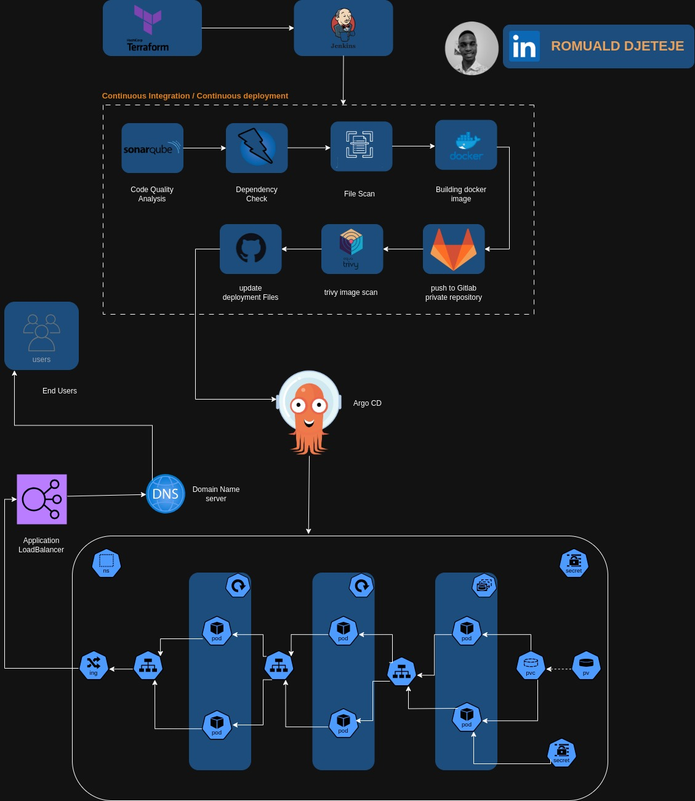

# Déploiement d'une application web à trois niveaux sur AWS EKS en utilisant AWS EKS, ArgoCD, Prometheus, Grafana et Jenkins!
 

Bienvenue dans le projet de déploiement d'application web à trois niveaux ! 🚀

Ce dépôt héberge la mise en œuvre d'une application web à trois niveaux utilisant ReactJS, NodeJS et MongoDB, déployée sur AWS EKS. Le projet couvre une large gamme d'outils et de pratiques pour une configuration DevOps robuste et évolutive.

## Table des matières

- **Code de l'application**
- **Code du pipeline Jenkins**
- **Serveur Jenkins avec Terraform**
- **Fichiers de manifests Kubernetes**
- **Détails du projet**

### Code de l'application

Le répertoire `Application-Code` contient le code source de l'application web à trois niveaux. Explorez ce répertoire pour découvrir les implémentations frontend et backend.

### Code du pipeline Jenkins

Dans le répertoire `Jenkins-Pipeline-Code`, vous trouverez les scripts de pipeline Jenkins. Ces scripts automatisent le processus CI/CD, assurant une intégration et un déploiement fluides de votre application.

### Serveur Jenkins avec Terraform

Explorez le répertoire `Jenkins-Server-TF` pour trouver les scripts Terraform pour la configuration du serveur Jenkins sur AWS. Ces scripts simplifient le processus de provisionnement de l'infrastructure.

### Fichiers de manifests Kubernetes

Le répertoire `Kubernetes-Manifests-Files` contient les manifests Kubernetes pour déployer votre application sur AWS EKS. Comprenez et personnalisez ces fichiers pour répondre aux besoins de votre projet.

### Détails du projet

🛠️ **Outils explorés :**

- **Terraform & AWS CLI** pour l'infrastructure AWS
- **Jenkins, Sonarqube, Terraform, Kubectl, et autres** pour la configuration CI/CD
- **Helm, Prometheus, et Grafana** pour la surveillance
- **ArgoCD** pour les pratiques GitOps

🚢 **Aperçu général :**

- Configuration de l'utilisateur IAM et magie de Terraform sur AWS
- Déploiement de Jenkins avec intégration AWS
- Création du cluster EKS et configuration du Load Balancer
- Dépôts ECR privés pour une gestion sécurisée des images
- Chartes Helm pour une configuration de surveillance efficace
- GitOps avec ArgoCD - la cerise sur le gâteau !

📈 **Le parcours couvre tout, de la configuration des outils au déploiement d'une application à trois niveaux, en assurant la persistance des données et en implémentant des pipelines CI/CD.**

### Pour commencer

Pour commencer avec ce projet, consultez notre guide complet qui vous accompagne dans la configuration des utilisateurs IAM, le provisionnement de l'infrastructure, la configuration des pipelines CI/CD, la création de clusters EKS, et plus encore.

### Contribuer

Nous accueillons les contributions ! Si vous avez des idées d'améliorations ou trouvez des problèmes, n'hésitez pas à ouvrir une pull request ou à signaler un problème.

Bon codage ! 🚀

